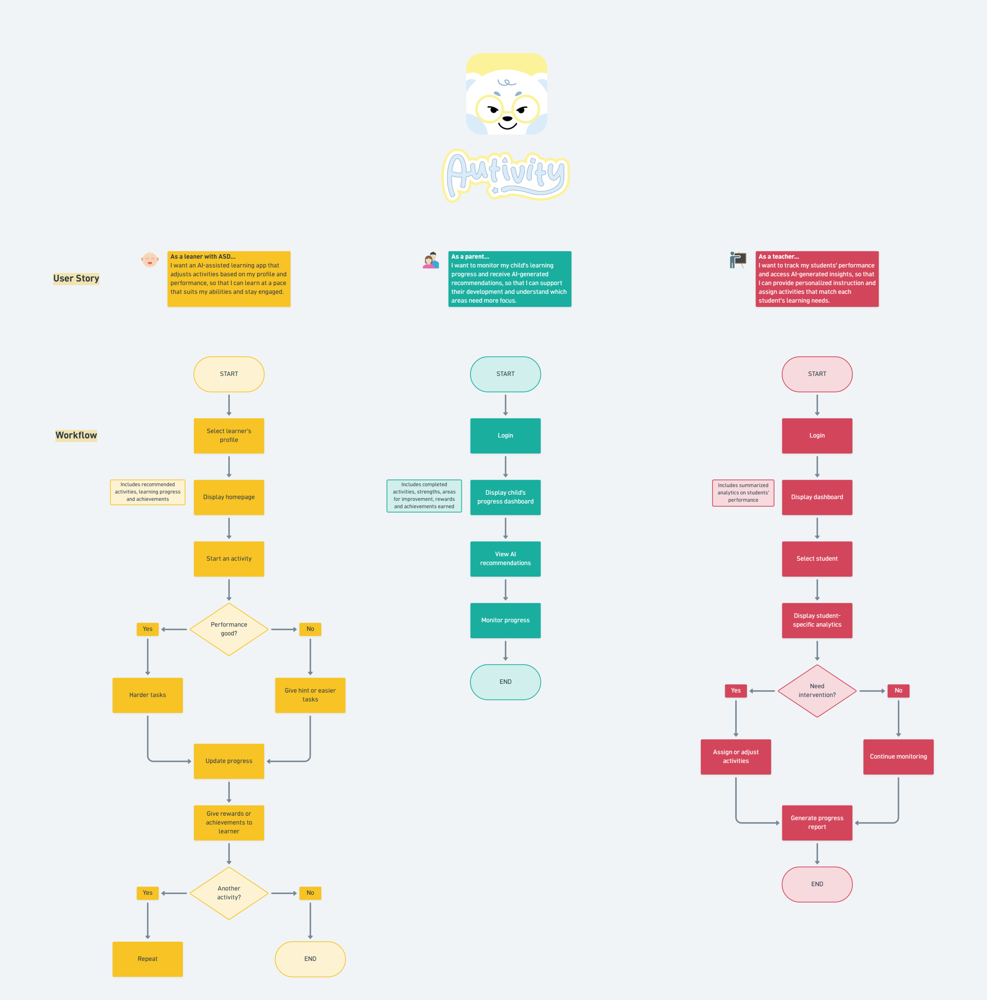

# Autivity — Product Workflow & User Stories

This repository contains the core product workflows and user stories for **Autivity**, an AI-assisted educational app designed for learners with ASD (Autism Spectrum Disorder), their parents, and teachers.

## 🗺️ Visual App Workflow

Below is the complete flowchart outlining user stories and sequential operational steps for each user:

---

## 👥 Core User Stories

### 1. Learner 
* **User Story:** *As a learner with ASD, I want an AI-assisted learning app that adjusts activities based on my profile and performance, so that I can learn at a pace that suits my abilities and stay engaged.
* **Key Features:** Adaptive learning paths, performance-driven tasks, and positive reinforcement reward mechanisms.

### 2. Parent 
* **User Story:** *As a parent, I want to monitor my child's learning progress and receive AI-generated recommendations, so that I can support their development and understand which areas need more focus.*
* **Key Features:** Activity completion logs, strength/weakness dashboards, and predictive AI recommendation metrics.

### 3. Teacher
* **User Story:** *As a teacher, I want to track my students' performance and access AI-generated insights, so that I can provide personalized instruction and assign activities that match each student's learning needs.*
* **Key Features:** Class-wide summarized analytics, student-specific insight filtering, and targeted intervention assignment engines.
