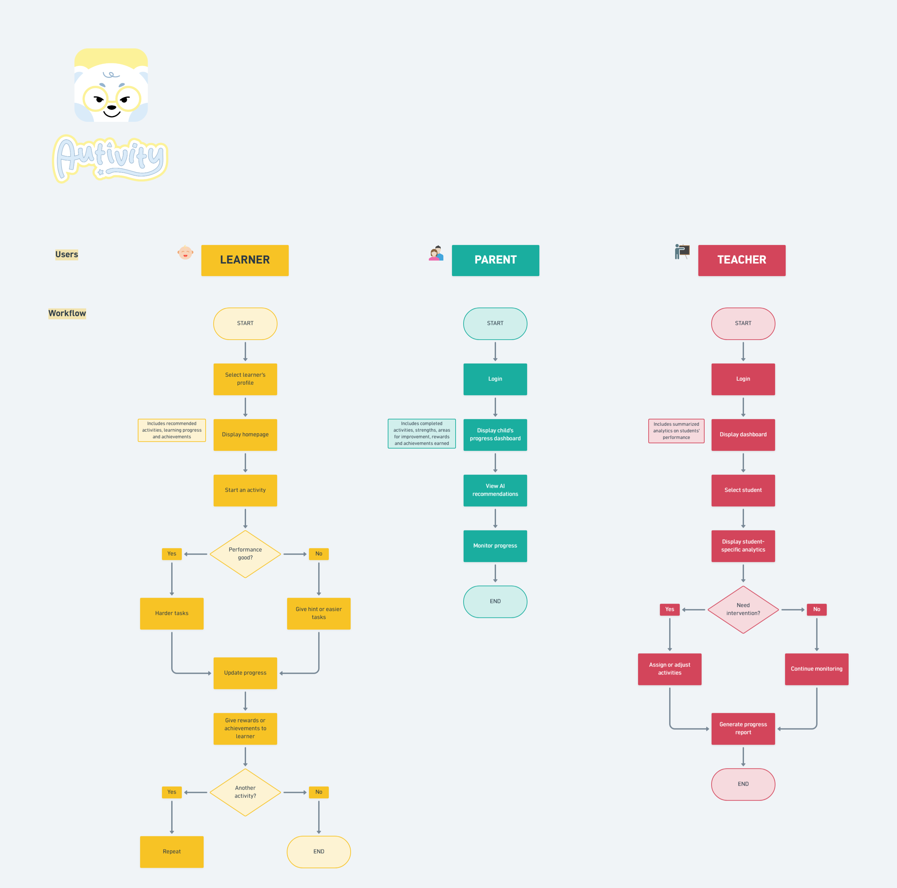

# AutiVity: System Users and Workflows

This document outlines the core workflows for the three primary users of the **AutiVity** platform: the Learner, the Parent, and the Teacher. 

---
## 1. Learner Workflow
The Learner workflow focuses on providing an adaptive, engaging, and rewarding experience tailored to the child's performance.

---
## 2. Parent Workflow
The Parent workflow is designed to provide clear visibility into the child's progress, strengths, and areas needing support at home.

---
## 3. Teacher Workflow
The Teacher workflow provides a comprehensive overview of the entire classroom, with the ability to drill down into specific student analytics to adjust Individualized Education Programs (IEPs).
