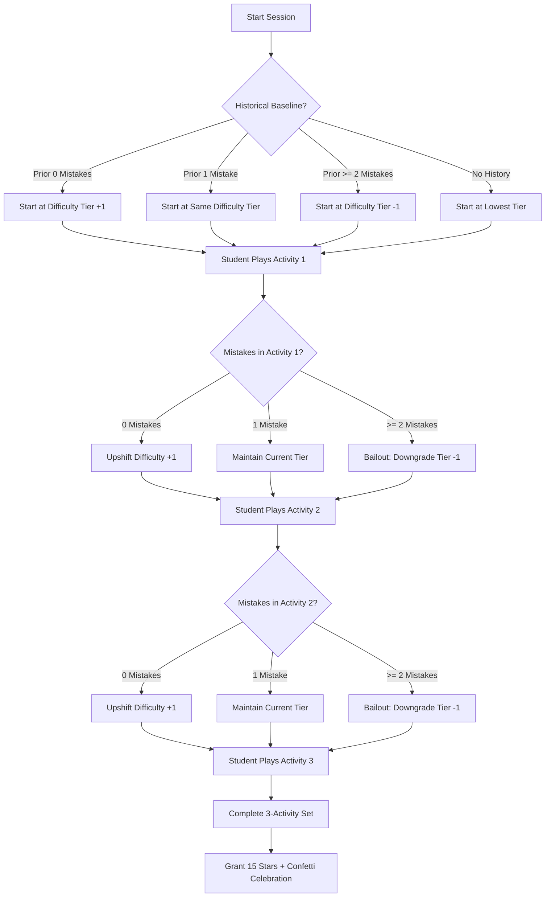

# Autivity: In-Session Adaptive Difficulty Engine & Scaffolding Flowchart

This document contains the standalone Mermaid flowchart and architecture breakdown for the **In-Session Adaptive Difficulty Loop** implemented in `components/set-manager.tsx`.

---

## 1. Mermaid Flowchart Code

---

## 2. Key Defense Explanations for PowerPoint Slides

### Phase 1: Baseline Calibration (Pre-Session)
* Before Activity 1 launches, the system queries `getStudentHistoricalBaseline` from `src/services/sessions.ts`.
* Dynamically calibrates starting difficulty to match the learner's demonstrated mastery rather than forcing them through repetitive easy levels.

### Phase 2: Real-Time In-Session Adaptation (Between Activities)
* Evaluated dynamically in `handleCheckPress` in `components/set-manager.tsx`:
  * **0 Mistakes**: Upshifts tier by **+1** (promotes mastery & challenge).
  * **1 Mistake**: Maintains current tier (**0**) (provides reinforcement).
  * **$\ge 2$ Mistakes**: Triggers **Frustration Bailout (-1 Tier)**.

### Phase 3: The 2-Mistake Frustration Bailout (Clinical Rationale)
* Repeated negative feedback induces high anxiety and cortisol spikes in neurodivergent learners, causing autistic shutdown or meltdown.
* By actively downgrading difficulty upon detecting $\ge 2$ mistakes, Autivity guarantees the learner concludes their 3-activity learning set with success, earning their **15 stars** and maintaining motivation.
